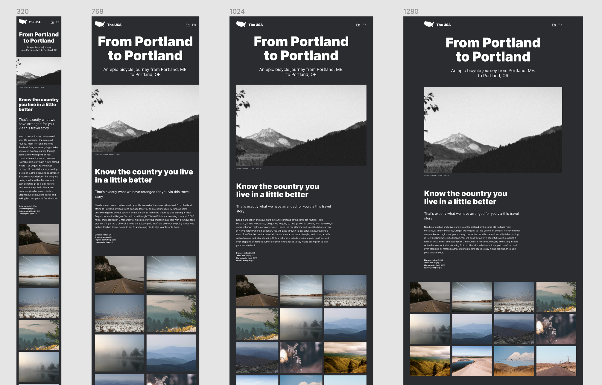

# Web Project 3 - From Portland to Portland

## Project description

This is the third Web Project for the Practicum Web Development bootcamp. The aim of this project was learning how to implement adaptive web design using media queries, which resulted in the responsive web page 'From Portland to Portland' about traveling across the US. The page is based on a design created in Figma and created with only HTML and CSS (Flexbox and Grid). The BEM methodology has been applied to structure both CSS and project files.

[Figma design file](https://www.figma.com/file/tGVujMSkus12HlSw9fbcLe/Sprint-3_-From-Portland-to-Portland-_-desktop-%2B-mobile?node-id=0%3A1)

## [**View live project**](https://denisehung.github.io/web_project_3/) :rocket:

## Technologies

- HTML
- CSS
- Flexbox
- Grid
- Figma
- BEM

## Getting started

```bash
# Clone repository
$ git clone https://github.com/denisehung/web_project_3.git
# Navigate to project directory
$ cd web_project_3
```

## Images
